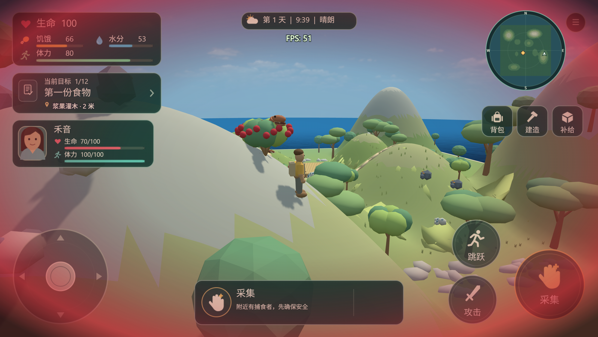

# 受击卡顿调查与修复（2026-09-23）

来源：`issues/issue-20260922-083852-446.md`。**问题仍未达到验收要求：不能声明全程稳定 60 FPS。** 已修复受击路径中可复现的重复工作，保留失败的性能门槛和后续长帧证据。

持续退化的根因已修复：隐藏的同伴任务文字不再无限追加。相同完整流程中，恢复阶段平均从 95.40 降至 14.70 ms，随后原报告视角从 278.19 降至 14.24 ms；这些是宿主机执行成本，不是呈现 FPS。严格逐帧预算仍失败，未放宽门槛。

## 受测版本

- 最终游戏源码：`f2dd6a6f1f95fd215833095a14863e5cd107678a`，`Stop hidden companion story text growing during touch combat`。后续文档/证据提交不改变受测游戏源码。
- 此前修复阶段：`a28ac33784c140657521ca4fdf838630254110d5`。下文的 `final-*`、`calibrated-*` 和原始正常播放截图对应这个阶段，不能作为最终源码的验证。
- 引擎文字修复：`113d5cb046547ee1e98ea903a917201554b6a6ee`，`Avoid redundant Pixi text rasterization for unchanged styles`。
- 最终引擎：`a1f76cc5aae42807cf43cf617eed3fd52ca17f51`，`Keep paused preview redraws outside profiled game frames`，包含上述文字修复。
- `intermediate.json` 的每个条目注明各自源码与引擎阶段；不能当作最终版本验收。原始引擎基线为 `689f44ee9af08c9e88aa11da062bd0597368fd85`。

## 最终受击流程

`post-story-DamagePerformance.json`：完整运行 1751 帧，16 项功能/有效测量断言通过，仅逐帧预算断言失败。使用同一引擎 `a1f76cc5aa`，修复前对照为 `calibrated-DamagePerformance.json`。

| 场景 | 修复前平均 ms | 修复后平均 ms | 修复后最大 ms |
| --- | ---: | ---: | ---: |
| 触屏静止 | 14.10 | 14.77 | 21.8 |
| 触屏受击蒙版 | 14.05 | 15.33 | 22.8 |
| 桌面静止 | 15.37 | 14.94 | 64.5 |
| 桌面受击蒙版 | 11.42 | 12.50 | 18.2 |
| 连续真实撕咬 | 23.36 | 15.11 | 26.0 |
| 攻击后恢复 | 95.40 | 14.70 | 22.7 |
| 后续原报告山地受击反馈 | 278.19 | 14.24 | 19.7 |

所有平均值现在低于 16.67 ms，但最大值并非如此。尤其桌面静止仍有一次 64.5 ms 长帧，所以不声明稳定 60 FPS。表中变化不是跨硬件或所有游戏状态的保证。

最终源码的 `DamageStoryBounds`、`DamageFeedback`、`TouchResponsive` 分别 6、13、24 项断言全部通过，对应 `post-story-*.json`。此前镜头测试的结果仅针对其注明版本；后续修复没有再修改镜头代码。

`post-story-FrameBudget60.json` 仍失败：营地移动平均 18.91 / 最大 74.3 ms，营地转镜头 18.14 / 74.3 ms，围栏移动 11.96 / 17.4 ms，山地转镜头 12.60 / 20.8 ms。营地基础渲染与事件成本仍是未满足全局 60 帧要求的一部分，与已修复的隐藏文字无限增长分别记录。

## 已落实的修复

0. **持续退化根因：** `scenes/Game/external-events/HeyinPresentation.events` 的基础文本重置只在桌面模式运行，但危险、体力、掉队等追加事件也在触屏模式逐帧运行。新 HUD 虽然隐藏旧 `HeyinStory`，引擎仍排版不断增长的文字。统一这些追加和排布事件的 TouchMode 条件后，隐藏文本不再增长。`story-before.json` 在未修复源码 `f852a17` 上仅 120 帧就记录了 2802 字符并失败；`post-story-DamageStoryBounds.json` 在最终源码上 6 项断言通过，首次触屏段始终为 0 字符，桌面内容仍包含目标和当前状态，切回触屏后内容保持不变。
1. `scenes/Game/external-events/HUDDamage.events`：触屏受击时不再每帧把蒙版从 Touch 移到 HUD 再移回 Touch。当前输入模式只选一个目标图层，同时保留视口覆盖与模式切换。
2. `scenes/Game/external-events/TouchLayout.events`、`TouchPresentation.events`：移除随后被新 HUD 覆盖的旧生命值文本、重复字号与排布。受击通知保留内容，游戏中的排布由 `HudPresentation.events` 负责，菜单保留自己的排布。
3. `scenes/Game/external-events/CameraVisibility.events`：头部探针已位于现有保守障碍包围盒内时，所有方向都有零距离命中，直接采用原算法的 10 单位最小净空；已得到最小净空时停止后续身体探针。镜头回归验证了平滑跟随、植物淡出与原有路线。
4. 引擎 `Extensions/TextObject/textruntimeobject-pixi-renderer.ts`：Pixi 的样式 setter 已按真实变化失效，不再重复强制 dirty。实际 Pixi 回归中，60 次相同样式/位置设置从 300 次额外文字绘制降为 0；真实字号、颜色、内容变化仍重绘并更新尺寸。
5. 引擎 `GDJS/Runtime/runtimescene.ts`：暂停重绘不再修改上一个已结束的剖析分项，也不会在首个测量帧之前调用尚未开始的剖析区间。此修复改善计时正确性，不能解释或豁免游戏本身的长帧。

引擎路径均相对于引擎仓库。修改经过本地构建，运行时已更新。

## 功能和运行验证

在游戏源码 `a28ac33`、引擎 `113d5cb046` 上，以下独立批次均为 completed / all_passed：

| 测试 | 断言数 | 证据 |
| --- | ---: | --- |
| 实际撕咬、12 点伤害、Hurt、提示、模式/尺寸切换及恢复 | 13 | `final-DamageFeedback.json` |
| 三种尺寸下触屏界面与菜单布局 | 24 | `final-TouchResponsive.json` |
| 镜头平滑跟随、遮挡、淡出、泉水路线与地平线 | 13 | `final-CameraSmoothFollow.json` |

最终引擎的 10 项相关单元/集成测试通过，见 `profiler-after.log`，包含文字回归、剖析边界和 RuntimeScene 集成测试。`profiler-before.log` 保留两个计时回归在修复前失败的记录；`engine-before.log` / `engine-after.log` 为文字失效修复的先失败后通过证据。

`runtime-verification.json` 对应隐藏文本修复前的游戏源码；最终源码证据是 `runtime-post-story.json`。后者校验和重新载入成功，7 项运行断言通过：玩家坐标有限、有可见 3D 网格、无运行错误、无失败纹理或被拒绝对象。工具的 completionReady 仅表示该组基础运行断言通过，不表示性能验收通过。

## 性能证据的解释

性能测试使用完整场景和 HUD，未通过删除地图或恐龙取得验收结果。`DamagePerformance` 包含触屏/桌面蒙版、真实连续撕咬、恢复和原报告山地视角，严格要求每个测量帧不超过 16.67 ms。`FrameBudget60` 使用既有的平均/桶 p95 ≤16.67 ms、最大 ≤33.33 ms 门槛；它比“每帧 60 FPS”宽松，仍不能代替该要求。

工具以不限制速度的方式推进模拟，数值是宿主机帧执行成本，不是正常播放的呈现帧率。超过 120 帧的窗口，frameTimesMs 返回每桶最大值，因此断言中的 p95 是桶最大值的分位数。工具只保留最后 5 份详细 profile；完整 7 个受击场景的均值/最大值保留在最终断言中。

独立短窗口诊断 `final-DamageCostBreakdown.json`（引擎 `113d5cb046`）：原报告位置静止平均 16.96 ms，受击蒙版 18.75 ms，加实际受击通知 19.56 ms。相同通知诊断在此前 `409fdc6` / 旧引擎上为 33.80 ms，说明重复工作有所下降；不同阶段的长帧和宿主机波动不允许据此承诺固定提升比例。暂停与缩短镜头距离的分支只用于诊断，不计入游戏性能验收。

`final-DamagePerformance.json` 与 `final-FrameBudget60.json` 为引擎 `113d5cb046` 下的完整测量，均失败。受击完整流程中连续撕咬平均 25.00 ms，恢复 90.12 ms，随后原报告视角 268.34 ms，最大 1394.60 ms。独立短测与长流程相差明显，不能只报告较快的短测。修正剖析边界后的结果另存为 `calibrated-*.json`，不覆盖旧证据。

## 正常播放和剩余问题

**隐藏文本修复前**，`a28ac33` / 最终引擎在 3014×1800 原始画布、原报告位置/视角正常播放，设置无敌并持续 HitFlash，以隔离反馈显示；这不是自然攻击次数或伤害测试。两次稀疏 FPSCounter.MeasuredFPS 读数约 21.70、9.87；截图显示 13 FPS，见 `live-samples.json` 和 `live-attack.png`。调试器序列化和窗口焦点会影响测量，这些不是逐帧分布。截图已查看：人物、山地、HUD、红色受击蒙版正常显示；通知已经自然到期。预览截图超时一次，暂停并聚焦后重拍成功。

临时引擎调用计时将根因收敛到 `Text.setText@HeyinStory`：恢复阶段 180 次调用累计约 6875 ms（约 38.2 ms/帧），镜头 JavaScript 同期约 1.9 ms/帧。见 `event-diagnostic-summary.json`。该诊断批次因附加计时开销达到超时，只有已结束的剖析窗口可用，不作为验收。临时插桩已全部撤销，引擎重新构建，随后才执行 `post-story-*` 最终回归。仍不得把功能通过或短测改善当作每帧 60 FPS 达标。

**修复后正常播放：** `live-samples-fixed.json` 对应 `f2dd6a6` / `a1f76cc5aa`，聚焦的预览在原报告视角持续显示受击反馈。场景时间 24.10 和 49.39 秒时，FPSCounter 的读数分别为 60.10 和 59.17；49.70 秒暂停后捕获的 `live-attack-fixed.png` 显示 51 FPS。这些结果说明没有复现此前持续降至约 10 FPS 的退化，但仍存在波动，不能以两次读数证明持续 60 FPS。此次画布为 3196×1800，与此前 3014×1800 略有差异，不作精确 FPS 倍率比较。截图已查看，人物、山地、HUD 与蒙版正常。采样后清除了临时无敌和持续 HitFlash 状态、释放输入，预览留在暂停状态。

