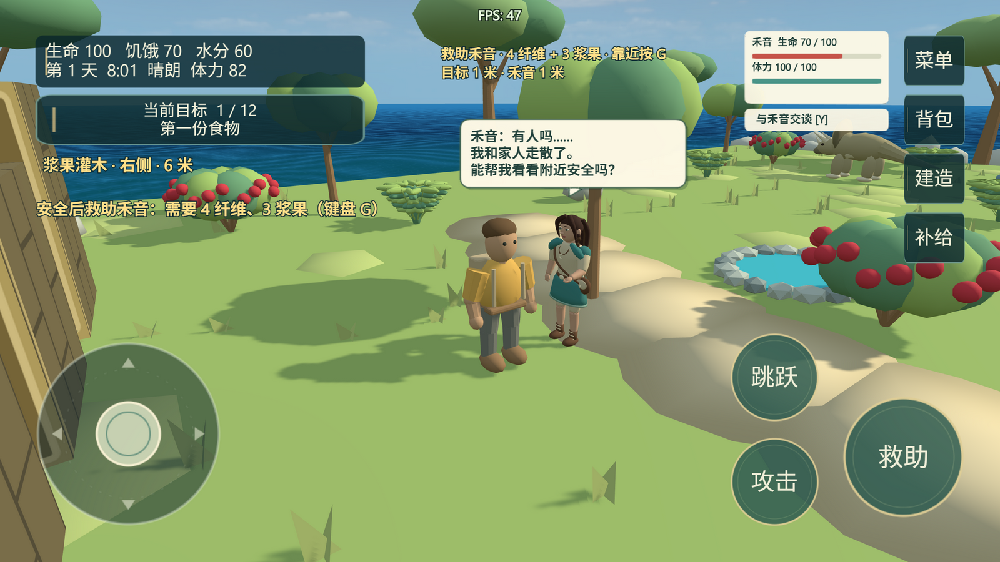
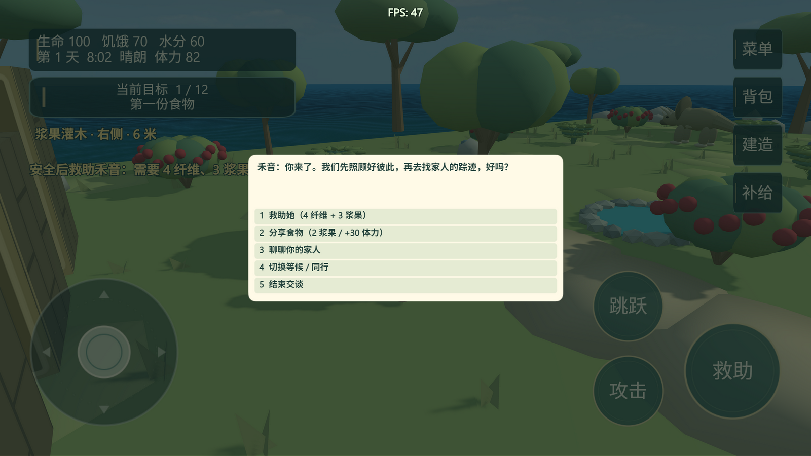

# 禾音生存与选择对话验收

源码版本：`6dce27be5b6fbb95ca7b332c5f3381a8c72f415d` — Keep companion HUD clear of menus and adapt narrow-screen dialogue。
日期：2026-09-22。此报告和截图提交只增加验收证据，不修改已验证的游戏源码。

## 实现

- `extensions/JurassicActors/prefabs/Heyin/functions/UpdateVitals.events`：独立生命、救助缓冲和受击保护；体力继续由该 prefab 的 UpdateAI 管理。
- `scenes/Game/functions/sceneUpdate.events`：迅猛龙、霸王龙选择同伴目标，锁定攻击前摇，分别结算玩家/同伴伤害。
- `scenes/Game/external-events/HeyinSurvival.events`：失血、保护失败与 5 秒自动整局重开。
- `scenes/Game/external-events/HeyinInteraction.events`：键盘和触屏选择、包扎、分食、家庭线索与一次性承诺。
- `scenes/Game/external-events/HeyinCompanionUI.events`：独立状态条、选择面板和失败提示。
- `scenes/Game/external-events/HeyinSave.events`、`HeyinRestore.events`：新增状态保存与 v1 缺省兼容。
- 维护说明：`docs/HEYIN_GAMEPLAY.md`、`docs/HEYIN_STORY.md`。

## 当前版本结果

结构、事件生成、扩展生成、JavaScript 作者 API 与语义验证全部通过。验证工具返回 runtimeVerified=true、completionReady=true；运行错误 0，World3D 拒绝对象 0。

| 测试文件 | 通过检查数 | 范围 |
| --- | ---: | --- |
| `tests/HeyinSurvival.js` | 19 | 失血与暂停、真实触屏与键盘选择、材料扣除、承诺防重复、两种捕食者真实攻击、致命攻击、倒计时重新载入、未救助致死 |
| `tests/HeyinPersistence.js` | 7 | 原触屏救助、菜单存取、生命/缓冲/信任/承诺恢复、跟随恢复 |
| `tests/HeyinBubble.js` | 12 | 头顶投影、轨道镜头、缩放、长文案、暂停及窄屏 |
| `tests/HeyinJourney.js` | 14 | 救助、等待、完整营地—清泉护送、体力休息、动画朝向、建筑阻挡 |
| `tests/HeyinCompanionUI.js` | 10 | 1600×900 与 568×320 状态栏、目标避让、触屏打开、分支选项边界、Esc 关闭 |

合计 62 项检查通过，5 个测试运行均 completed 且 all_passed=true。完整操作 ID 和断言见 [results.json](results.json)。未运行全部项目测试，也未做长时间性能压力测试。

## 画面检查

以下截图来自同一源码版本的新预览，已检查状态条、气泡、菜单按钮和选择文字，不使用历史截图作为本次证据。

实现沿用项目已有原生战斗、物资、UI 和存档结构，这些小规模同伴规则无需新引入大型扩展。完整导航寻路与北方团聚章节仍按故事规划后续制作。
